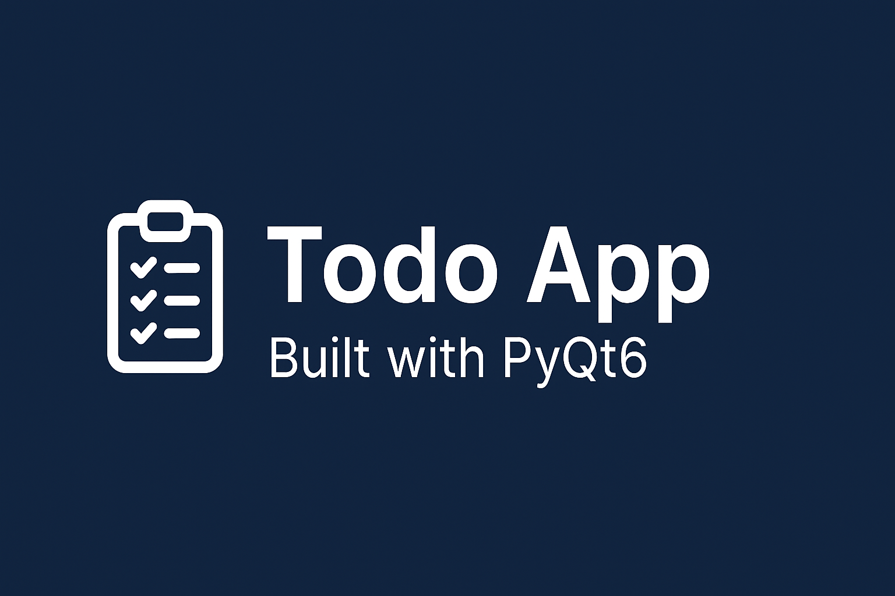
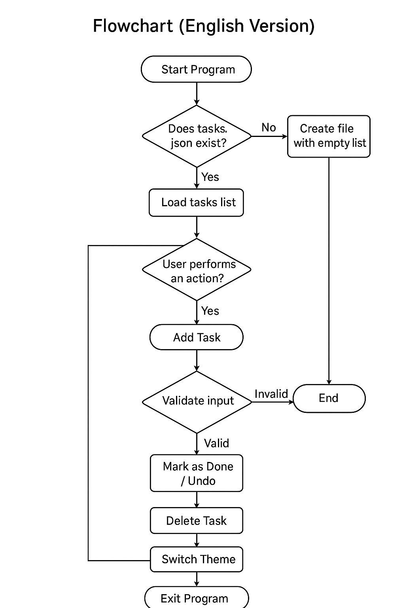

<p align="center">
  

</p>

<h1 align="center">📋 Todo App – PyQt6 (Material UI + Dark Mode)</h1>

<p align="center">
  برنامه مدیریت کارهای روزانه با رابط کاربری مدرن، ساخته شده با PyQt6
</p>

<p align="center">
  
  
  
  
</p>

---

## 🚀 ویژگی‌ها

- 🎨 طراحی مدرن (Material)
- 🌙 دارک مود و لایت مود
- ✔️ افزودن / حذف / انجام کارها
- 💾 ذخیره‌سازی در فایل JSON (بدون نیاز به دیتابیس)
- ⚡ انیمیشن هنگام افزودن کار جدید
- 🖼️ آیکون داخلی Base64 (بدون فایل خارجی)
- 🔧 سازگار با Windows / Linux / macOS

---

## 📦 ساختار پروژه

main.py
icons.py
tasks.json
style_light.qss
style_dark.qss
requirements.txt


---

## 🛠️ نصب و اجرا

### 1️⃣ نصب پایتون  
به پایتون نسخه **3.9 یا بالاتر** نیاز دارید.  
دانلود از سایت رسمی:  
https://www.python.org/downloads/

> ⚠️ در ویندوز هنگام نصب، گزینه **Add to PATH** را حتماً فعال کنید.

---

### 2️⃣ نصب وابستگی‌ها

در مسیر پروژه:

```bash
pip install -r requirements.txt

3️⃣ اجرای برنامه
python main.py

🧩 وابستگی‌ها

PyQt6

✨ برنامه‌ریزی برای آینده

 Drag & Drop برای جابه‌جایی کارها

 دسته‌بندی کارها

 اعلان (Notification) هنگام انجام کار

 ساخت نسخه EXE کاملاً مستقل برای ویندوز

📄 لایسنس

MIT License © 2025 – Created by [Zahra Sabbaq]

---
